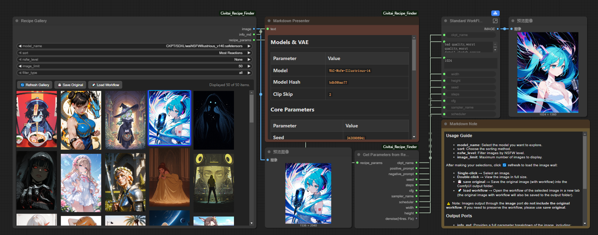
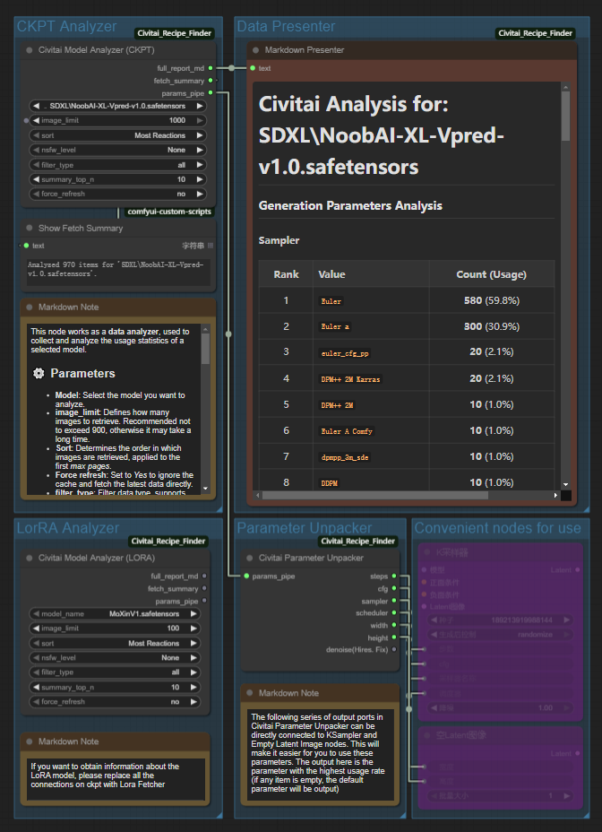
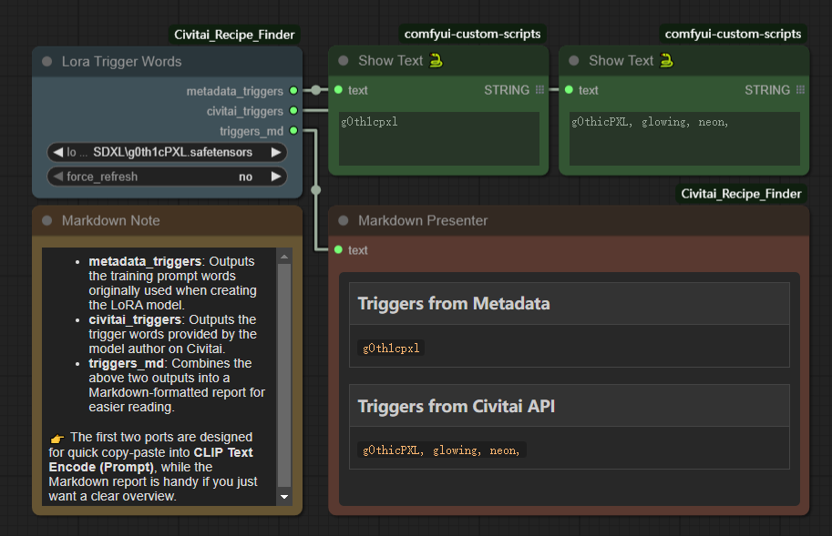

# Civitai Recipe Finder

> 👉 [点击这里查看中文文档](./README_ZH.md)

## Overview

In AI art creation, discovering the right **recipe**—the optimal combination of models, trigger words, prompts, and generation parameters—often matters more than tweaking individual settings.

**Civitai Recipe Finder** is a powerful set of custom nodes designed for **ComfyUI**, helping you quickly explore, reproduce, and analyze creative recipes from the Civitai community. It can even provide instant visual insights for your **local models**.

Whether you want to **reproduce trending artworks in one click** or **dig deep into community usage trends**, this toolkit offers **efficient, intuitive, and flexible** support.

---

## Key Features

* 🔍 **Visual Recipe Discovery**
  Instantly browse popular Civitai artworks for a given local model and reproduce their full recipe (prompts, parameters, LoRA combinations, workflows, etc.).

* ⚡ **Instant Trigger Word Lookup**
  Extract official trigger words and metadata trigger words from any LoRA model.

* 📊 **Community Trend Analysis**
  Aggregate hundreds of community images to identify the most frequent prompts, samplers, CFG scales, step counts, and more.

* 🔗 **Golden Combination Insights**
  Discover which LoRAs are most commonly paired with a specific model.

* 🛠 **Modular & Extensible**
  Provided as a flexible node suite—lightweight for daily use, yet powerful enough for complex deep-dive workflows.

---

## Node Suite

Recipe Finder consists of three categories of nodes to cover different usage scenarios.

### 1. Visual Recipe Finder

#### `Civitai Recipe Gallery`

* **Purpose**: Browse community galleries for a selected local model and reproduce the full recipe in one click.
* **New Features**:

  * 🚀 **One-Click Workflow Loading** – Safely load the original workflow of an image (with ComfyUI-Manager support, auto-opens in a new tab).
  * 💾 **Save Original File** – Download the unmodified original image (with full workflow metadata) to your `output` folder.

| Output Port     | Type            | Description                                                         |
| --------------- | --------------- | ------------------------------------------------------------------- |
| `image`         | `IMAGE`         | Selected community example image                                    |
| `info_md`       | `STRING`        | Unified Markdown recipe report (connect to `MarkdownPresenter`)     |
| `recipe_params` | `RECIPE_PARAMS` | Parameter pipeline (to be unpacked by `Get Parameters from Recipe`) |

> ⚠️ **First Run Notice**
>
> * On the first run, all local model **hashes** will be calculated, which may take a while.
> * Cache is stored in `Civitai_Recipe_Finder/data`.
> * Subsequent runs only process new models.



#### `Get Parameters from Recipe`

* **Purpose**: Unpacks the `recipe_params` pipeline into individual outputs compatible with downstream nodes (e.g., `KSampler`).
* **Outputs**: `ckpt_name`, `positive_prompt`, `negative_prompt`, `seed`, `steps`, `cfg`, `sampler_name`, `scheduler`, `width`, `height`, `denoise`

---

### 2. In-Depth Model Analysis

Core node: **`Model Analyzer (Checkpoint / LoRA)`**

* **Purpose**:
  A fully integrated engine that performs **data fetching → community statistics → parameter analysis → unified reporting**.
  Replaces the old `Data Fetcher` + multiple Analyzer nodes.

* **Inputs**: `model_name`, `image_limit`, `sort`, `nsfw_level`, `filter_type`, `summary_top_n`, `force_refresh`

* **Outputs**:

  * `full_report_md` – Complete Markdown report
  * `fetch_summary` – Fetch summary (e.g., “Successfully analyzed 100 items”)
  * `params_pipe` – Pipeline of most common parameters (to be unpacked by `Get Parameters from Analysis`)



#### `Get Parameters from Analysis`

* **Purpose**: Unpacks the `params_pipe` into the most common parameter set used in the community.
* **Outputs**: Same as `Get Parameters from Recipe`.

---

### 3. Lightweight Tool

#### `Lora Trigger Words`

* **Purpose**: Instantly retrieve trigger words for a given LoRA model.
* **Outputs**:

  * `metadata_triggers` – Extracted from local metadata
  * `civitai_triggers` – From Civitai API
  * `triggers_md` – Comparison table in Markdown



---

## Installation & Usage

1. Place the project folder under `ComfyUI/custom_nodes/`, for example:

   ```bash
   ComfyUI/custom_nodes/CivitaiProject/
   ```
2. Install dependencies:

   ```bash
   pip install -r requirements.txt
   ```
3. Restart ComfyUI. The nodes will appear in the `Civitai` menu.

> 💡 **Tip**:
> The `Markdown Presenter` node can be found under the `Display` menu or by searching for "Markdown Presenter".

---

## Example Workflows

* **Within ComfyUI**: *Templates → Custom Nodes → ComfyUI-Civitai-Recipe*
* **From Repository**: [example\_workflows](./example_workflows)

---

## Version Compatibility

* **Migration for ≤ v3.1**
  Go to `Settings → CivitaiUtils → Migration` to migrate old JSON cache files into the new database.

---

## Changelog

### \[3.2.0] - 2025-09-23

#### Added

* **Database Management Panel** – Clear analyzer, API, and trigger word caches in one click.
* **Video Resource Support** – `Recipe Gallery` and `Model Analyzer` now support video-based recipes.

#### Changed

* **Core Architecture Refactor** – Cache system upgraded from scattered JSON files to a unified `SQLite` database for speed, stability, and future extensibility.
* **Simplified Node Workflow** – Legacy nodes merged into a single **`Model Analyzer`** node.
* **Naming Consistency**:

  * `Recipe Params Parser` → **`Get Parameters from Recipe`**
  * Analyzer params parser → **`Get Parameters from Analysis`**
* **Database Tools** – New **`🗃️ Database & Models`** panel: view scanned models, refresh database, clear cache, and migrate from legacy JSON cache.

---

## Acknowledgements

* Trigger word logic inspired by:
  [Extraltodeus/LoadLoraWithTags](https://github.com/Extraltodeus/LoadLoraWithTags)
  [idrirap/ComfyUI-Lora-Auto-Trigger-Words](https://github.com/idrirap/ComfyUI-Lora-Auto-Trigger-Words)

* Gallery node design inspired by:
  [Firetheft/ComfyUI\_Civitai\_Gallery](https://github.com/Firetheft/ComfyUI_Civitai_Gallery)

Special thanks to the authors of the above projects for their contributions and inspiration!
