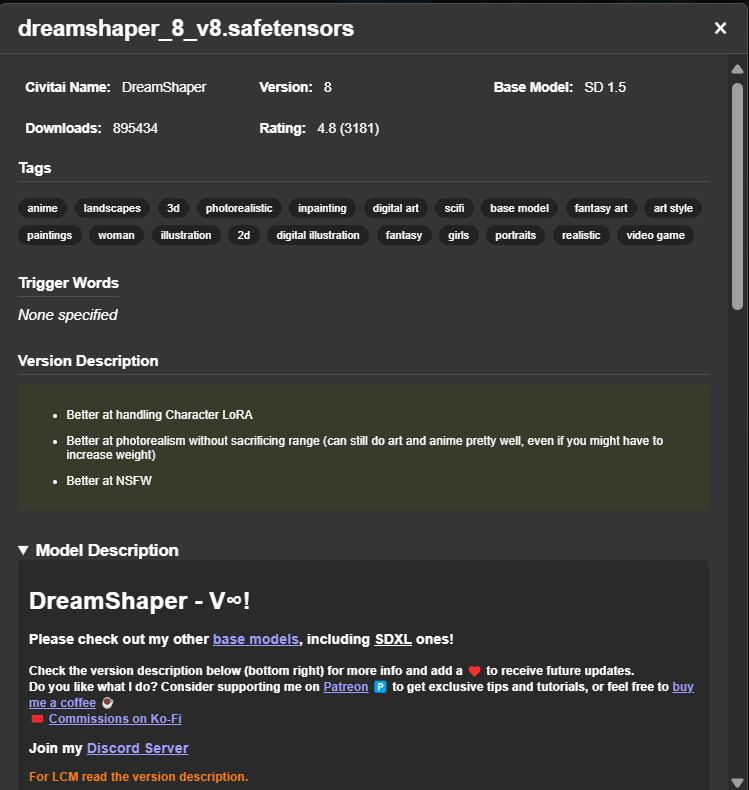

# Civitai Toolkit

> 👉 [点击这里查看中文文档](./README_ZH.md)


<details>
  <summary>🕒 <b>Changelog (click to expand)</b></summary>

## [4.0.2] - 2025-10-07  

**Summary:**  
Adds API Key support to improve reliability, authentication, and request limits for all Civitai API interactions.  

### 🚀 Added  
#### 🔑 **API Key Management**  
- Introduced a brand-new **“API Key Management”** section in the **ComfyUI Settings Panel**.  
- Users can now **generate an API Key** from their **Civitai Account Page** and **enter it directly** in the plugin settings.  
- Once saved, all plugin requests to Civitai will **automatically include Authorization headers** for authentication.  

💡 **Why this matters:**  
This feature helps users **increase API rate limits** and **prepare for upcoming Civitai features** that may require authentication.  
You can create and manage your API Key on the **Civitai Account Settings** page.  

---

## [4.0.1] - 2025-10-06  

### Fixes  
- **Startup freeze issue**:  
  Some users reported that ComfyUI would hang indefinitely on startup when having a large number of LoRA models.  
  This update fixes the issue by moving the scanning process to the background.  

### Improvements  
- **Background processing**:  
  Model **hashing** and **Civitai info fetching** now run asynchronously in the background, allowing ComfyUI to start instantly.  
- **Resume support**:  
  Added **progress persistence**, resuming from the last saved state instead of starting over.  

---

## [4.0.0] - 2025-10-05  

#### 💥 Major Updates  
- Officially renamed to **Civitai Toolkit** to reflect its all-in-one suite positioning.  
- The original `Recipe Finder` remains as a core module.  

#### ✨ New & Improved  
- **Dual Sidebar UI**: introduces `Local Model Manager` and `Civitai Online Browser`.  
- **Enhanced UX**: smoother interaction and higher model management efficiency.  

</details>

## Overview

**Civitai Toolkit** is an **all-in-one Civitai integration hub** built exclusively for **ComfyUI**.
It seamlessly combines **online browsing and discovery**, **local model management**, and **recipe reconstruction & data analysis** — enabling you to go from inspiration to realization **without ever leaving ComfyUI**.

No more switching between your browser and file manager — with **two powerful sidebar panels** and a suite of **analysis nodes**, you’ll enjoy a complete Civitai experience directly inside ComfyUI.

---

## ✨ Key Features

* 🌍 **Civitai Online Browser**
  Access Civitai directly within ComfyUI. Search, filter, and download models in one click.

* 🗂️ **Local Model Manager**
  Browse, search, and categorize local models with automatic Civitai metadata linking.

* 🔍 **Visual Recipe Finder**
  Instantly explore a model’s popular works and restore full generation recipes (prompts, params, LoRA combos, etc.).

* 📊 **Community Trend Analysis**
  Automatically collect common generation parameters and discover popular sampler, CFG, and prompt combinations.

* 🔗 **Golden Combination Discovery**
  Reveal high-frequency co-usage between models and discover new creative synergies.

* ⚡ **Instant Trigger Word Extraction**
  Extract trigger words from both local metadata and Civitai API, then generate a clean Markdown comparison table.

---

## 🧭 Core Interfaces: Sidebar System

### 🌍 Civitai Online Browser

**Highlights:**

* 🔎 **Advanced Search & Filtering** — by keywords, model type, base model, sorting (Hot / New / Top Rated), etc.
* 🔄 **Local Sync** — automatically marks models as “Downloaded” to prevent duplicates.
* 🖼️ **Immersive Detail View** — model descriptions, version selector, sample gallery, file list, and direct download links.

<div align="center" style="display: flex; flex-wrap: wrap; justify-content: center;">
  
  
</div>

---

### 🗂️ Local Model Manager

**Highlights:**

* 🔍 **Auto Scan & Recognition** — indexes local models and matches them to Civitai database via Hash.
* 💬 **Rich Info Display** — view version details, trigger words, ratings, downloads, and more.
* ⚡ **Streamlined Interaction** — filter by type, keyword search, and one-click copy for Hash or triggers.

<div align="center" style="display: flex; flex-wrap: wrap; justify-content: center;">
  
  
</div>

---

## 🧩 Core Node Suite

### 1️⃣ Visual Recipe Finder

#### `Civitai Recipe Gallery`

* Browse top-rated works for a given model and load full recipes in one click.
* 🚀 **Instant Workflow Restore** — safely and smartly reconstructs original workflows (ComfyUI-Manager compatible).
* 💾 **Save Source Files** — download images with embedded metadata to the `output` directory.

| Output Port     | Type            | Description                                                  |
| --------------- | --------------- | ------------------------------------------------------------ |
| `image`         | `IMAGE`         | Selected sample image                                        |
| `info_md`       | `STRING`        | Markdown recipe report (recommended for `MarkdownPresenter`) |
| `recipe_params` | `RECIPE_PARAMS` | Parameter pipeline (use with `Get Parameters from Recipe`)   |

> ⚠️ **First Run Notice:**
> The first run computes model hashes (may take some time). Results are cached in `Civitai Toolkit/data` or `Civitai_Recipe_Finder/data` for faster future runs.


#### `Get Parameters from Recipe`

Unpack the `recipe_params` pipeline and output generation-ready parameters for `KSampler`:
`ckpt_name`, `positive_prompt`, `negative_prompt`, `seed`, `steps`, `cfg`, `sampler_name`, `scheduler`, `width`, `height`, `denoise`.

---

### 2️⃣ In-Depth Model Analysis

**Node:** `Model Analyzer (Checkpoint / LoRA)`

**Features:**

* Unified process from data fetching → community statistics → parameter summary → Markdown report.
* Replaces legacy multi-node setups with faster, cleaner analysis.

**Inputs:** `model_name`, `image_limit`, `sort`, `nsfw_level`, `filter_type`, `summary_top_n`, `force_refresh`
**Outputs:**

* `full_report_md`: Full Markdown report
* `fetch_summary`: Fetch summary (e.g., “Analyzed 100 entries successfully”)
* `params_pipe`: Extracted community parameter pipeline (use with `Get Parameters from Analysis`)


#### `Get Parameters from Analysis`

Unpack the `params_pipe` to extract community-common parameters — works the same as `Get Parameters from Recipe`.

---

### 3️⃣ Lightweight Tools

#### `Lora Trigger Words`

Instantly extract LoRA trigger words:

| Output Port         | Type     | Content                            |
| ------------------- | -------- | ---------------------------------- |
| `metadata_triggers` | `STRING` | Local metadata trigger words       |
| `civitai_triggers`  | `STRING` | Official Civitai API trigger words |
| `triggers_md`       | `STRING` | Markdown comparison table          |


---

## ⚙️ Installation & Usage

### ✅ Manual Installation

```bash
ComfyUI/custom_nodes/ComfyUI-Civitai-Toolkit/
pip install -r requirements.txt
```

### ✅ Install via ComfyUI Manager

Search **Civitai Toolkit** in ComfyUI Manager → click “Install” → restart ComfyUI.
You’ll find the toolkit in the sidebar and under the `Civitai` node category.

> 💡 Tip:
> The `Markdown Presenter` node can be found under the `Display` category.

---

## 🧪 Workflow Examples

* **Built-in Template:** `Templates → Custom Nodes → ComfyUI-Civitai-Recipe`
* **Repository Samples:** [example_workflows](./example_workflows)

---

## 🔧 Version Compatibility

* **Migration from ≤3.1:**
  Go to `Settings → CivitaiUtils → Migration` to transfer old JSON cache into the new database.

---

## 🙏 Credits

* **Trigger Word Logic References:**

  * [Extraltodeus/LoadLoraWithTags](https://github.com/Extraltodeus/LoadLoraWithTags)
  * [idrirap/ComfyUI-Lora-Auto-Trigger-Words](https://github.com/idrirap/ComfyUI-Lora-Auto-Trigger-Words)

* **Gallery Design Inspiration:**

  * [Firetheft/ComfyUI_Civitai_Gallery](https://github.com/Firetheft/ComfyUI_Civitai_Gallery)

* **Sidebar Design Reference:**

  * [BlafKing/sd-civitai-browser-plus](https://github.com/BlafKing/sd-civitai-browser-plus)

> Heartfelt thanks to all the amazing open-source projects and their authors 🙌
