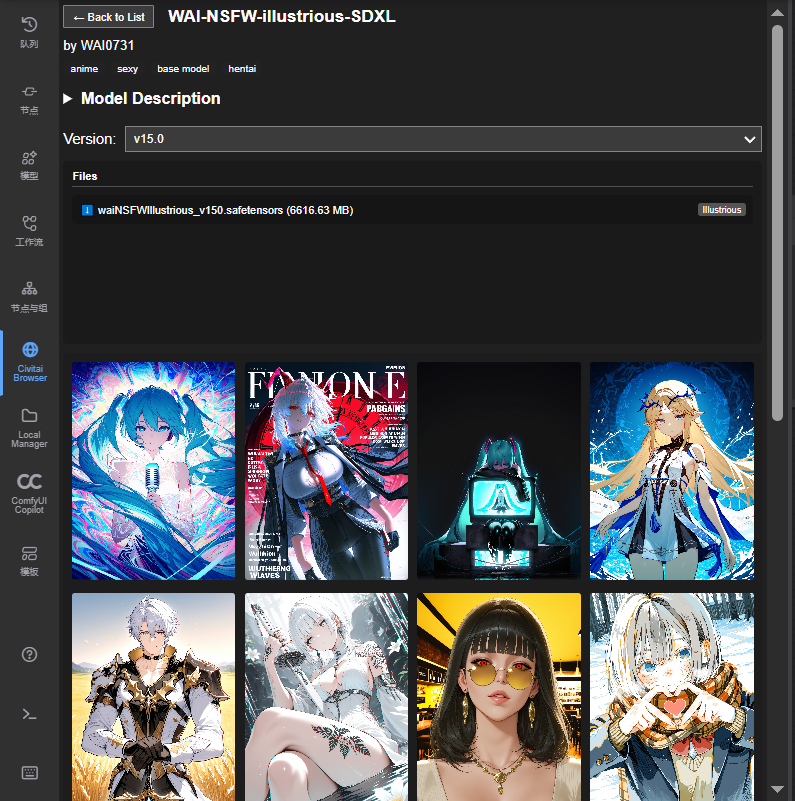
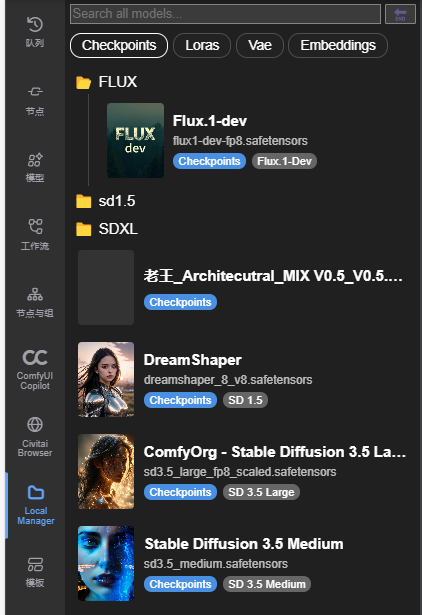
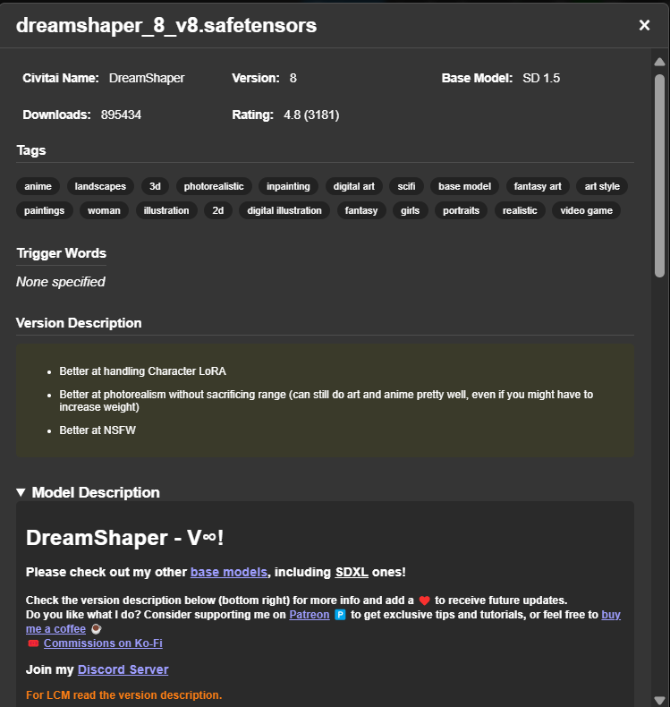

# Civitai Toolkit（Civitai 工具箱）

## 项目简介

**Civitai Toolkit** 是一套专为 **ComfyUI** 打造的 **一站式 Civitai 集成中心**。
它将 **在线浏览与发现**、**本地模型管理**、**配方复现与数据分析** 三大核心功能完美融合，让您在创作工作流中即可完成从灵感发现到最终实现的全过程。

不再需要在浏览器与文件管理器之间反复切换——通过两款强大的 **常驻侧边栏** 与一组专业的 **分析节点工具**，您即可在 ComfyUI 内畅享完整的 Civitai 使用体验。

---

## ✨ 功能亮点

* 🌍 **Civitai 在线浏览器**
  在 ComfyUI 内直接访问 Civitai，搜索、筛选、下载模型一步到位。

* 🗂️ **本地模型管理器**
  轻松浏览、搜索和分类您的本地模型，自动关联 Civitai 社区信息。

* 🔍 **可视化配方查找**
  一键浏览模型的热门作品，快速复现其完整配方（提示词、参数、LoRA 组合等）。

* 📊 **社区趋势分析**
  自动统计社区常用参数，提取最受欢迎的采样器、CFG、提示词等黄金组合。

* 🔗 **黄金组合发现**
  揭示模型间的高频搭配关系，助您挖掘潜在创作灵感。

* ⚡ **即时触发词提取**
  同时提取官方与本地元数据触发词，并生成美观的 Markdown 对照表。

---

## 🧭 两大核心界面：侧边栏系统

### 🌍 Civitai 在线浏览器（Civitai Online Browser）

**核心特性：**

* 🔎 **多维度搜索与筛选**：支持关键词、模型类型、基础模型、排序方式（最热 / 最新 / 最高评分）等。
* 🔄 **本地状态同步**：自动识别已下载模型，并标注“**已下载**”徽章，避免重复下载。
* 🖼️ **沉浸式详情页**：展示模型介绍、版本切换、示例画廊、文件列表与直接下载链接。

<div align="center" style="display: flex; flex-wrap: wrap; justify-content: center;">
  
  
</div>


---

### 🗂️ 本地模型管理器（Local Model Manager）

**核心特性：**

* 🔍 **自动扫描与识别**：自动索引本地模型并通过 Hash 匹配 Civitai 数据库，获取完整社区信息。
* 💬 **信息展示丰富**：点击模型卡片可查看版本说明、触发词、社区评分、下载量等。
* ⚡ **便捷交互体验**：支持类型筛选、关键词搜索，并提供触发词 / Hash 一键复制。
<div align="center" style="display: flex; flex-wrap: wrap; justify-content: center;">
  
  
</div>

---

## 🧩 核心节点套件

### 1️⃣ 可视化配方查找器（Visual Recipe Finder）

#### `Civitai Recipe Gallery`（Civitai 配方画廊）

* 浏览指定模型的热门作品，一键加载其完整配方。
* 🚀 **一键加载工作流**：智能、安全地恢复图片原始工作流（兼容 ComfyUI-Manager）。
* 💾 **保存源文件**：支持下载含元数据的原始图像至 `output` 目录。

| 输出端口            | 类型              | 说明                                         |
| --------------- | --------------- | ------------------------------------------ |
| `image`         | `IMAGE`         | 选中的示例图片                                    |
| `info_md`       | `STRING`        | 配方 Markdown 报告（推荐接入 `MarkdownPresenter`）   |
| `recipe_params` | `RECIPE_PARAMS` | 核心参数管道（配合 `Get Parameters from Recipe` 使用） |

> ⚠️ **首次运行提示**：
> 首次运行会计算本地模型 Hash（可能耗时较长），结果缓存至 `Civitai Toolkit/data`或`Civitai_Recipe_Finder/data`，后续仅增量处理。


#### `Get Parameters from Recipe`（从配方获取参数）

解包 `recipe_params` 管道，输出可直接用于 `KSampler` 等节点的生成参数：
`ckpt_name`, `positive_prompt`, `negative_prompt`, `seed`, `steps`, `cfg`, `sampler_name`, `scheduler`, `width`, `height`, `denoise`。

---

### 2️⃣ 模型深度分析（In-Depth Model Analysis）

核心节点：`Model Analyzer (Checkpoint / LoRA)`

**功能特性：**

* 一站式完成数据抓取 → 社区统计 → 参数分析 → 报告输出。
* 替代旧版多节点组合，分析更快更清晰。

**输入**：`model_name`, `image_limit`, `sort`, `nsfw_level`, `filter_type`, `summary_top_n`, `force_refresh`
**输出**：

* `full_report_md`：完整 Markdown 报告
* `fetch_summary`：抓取摘要（如“成功分析 100 个项目”）
* `params_pipe`：社区常用参数（配合 `Get Parameters from Analysis` 解包）


#### `Get Parameters from Analysis` (从分析获取参数)

解包 `params_pipe`，提取社区常用参数。 与 `Get Parameters from Recipe` 相同。

---

### 3️⃣ 轻量级工具（Lightweight Tools）

#### `Lora Trigger Words`（LoRA 触发词）

即时提取 LoRA 模型的触发词：

| 输出端口                | 类型       | 内容           |
| ------------------- | -------- | ------------ |
| `metadata_triggers` | `STRING` | 本地元数据触发词     |
| `civitai_triggers`  | `STRING` | 官方 API 触发词   |
| `triggers_md`       | `STRING` | Markdown 对照表 |


---

## ⚙️ 安装与使用

### ✅ 手动安装

```bash
ComfyUI/custom_nodes/ComfyUI-Civitai-Toolkit/
pip install -r requirements.txt
```

### ✅ ComfyUI Manager 安装

在 ComfyUI Manager 中搜索 **Civitai Toolkit**，点击“安装”，然后重启 ComfyUI。
安装后即可在侧边栏与 `Civitai` 节点菜单中找到工具箱。

> 💡 小贴士：
> `Markdown Presenter` 节点可在 `Display` 分类下找到。

---

## 🧪 工作流示例

* **ComfyUI 内置模板**：`Templates → Custom Nodes → ComfyUI-Civitai-Recipe`
* **仓库示例目录**：[example_workflows](./example_workflows)

---

## 🔧 版本兼容性

* **3.1 及之前版本迁移**：
  打开 `Settings → CivitaiUtils → Migration`，即可将旧版 JSON 缓存迁移到新数据库。

---

## 🌐 国内网络支持

在 `Settings → CivitaiUtils → Civitai Helper Network` 中选择访问环境：

* 🌏 **International（默认）** – 国际访问
* 🇨🇳 **China Mirror** – 国内镜像，加速访问更稳定


---

## 🕒 更新日志

### [4.0.0] - 2025-10-05

#### 💥 重大变更

* 项目正式更名为 **Civitai Toolkit**，以体现综合性工具套件定位。
* 原 `Recipe Finder` 现作为核心功能模块保留。

#### ✨ 新增与优化

* **新增双侧边栏 UI**：`本地模型管理器` 与 `Civitai 在线浏览器`。
* **全面优化交互体验**：模型管理与发现效率显著提升。

---

## 🙏 鸣谢

* 触发词逻辑参考：

  * [Extraltodeus/LoadLoraWithTags](https://github.com/Extraltodeus/LoadLoraWithTags)
  * [idrirap/ComfyUI-Lora-Auto-Trigger-Words](https://github.com/idrirap/ComfyUI-Lora-Auto-Trigger-Words)

* 画廊设计思路参考：

  * [Firetheft/ComfyUI_Civitai_Gallery](https://github.com/Firetheft/ComfyUI_Civitai_Gallery)

* 侧边栏设计参考：

  * [BlafKing/sd-civitai-browser-plus](https://github.com/BlafKing/sd-civitai-browser-plus)

> 向以上优秀项目及作者致以诚挚感谢 🙌