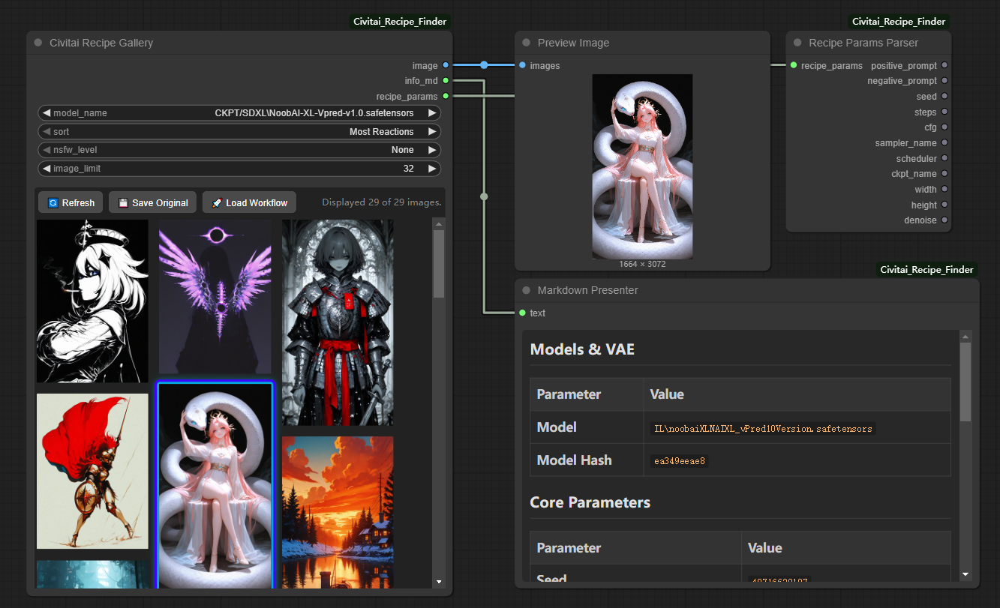
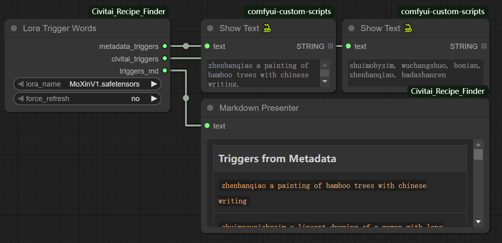
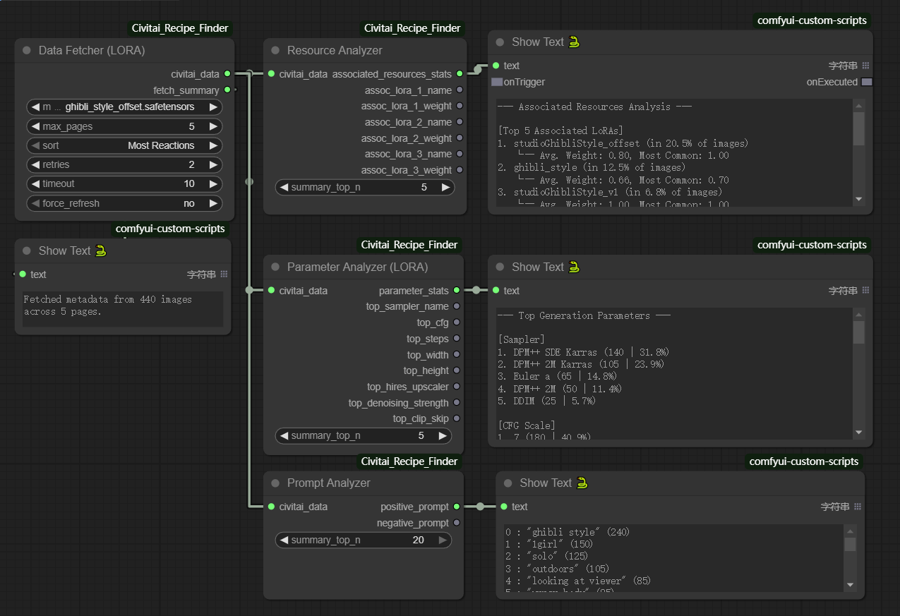
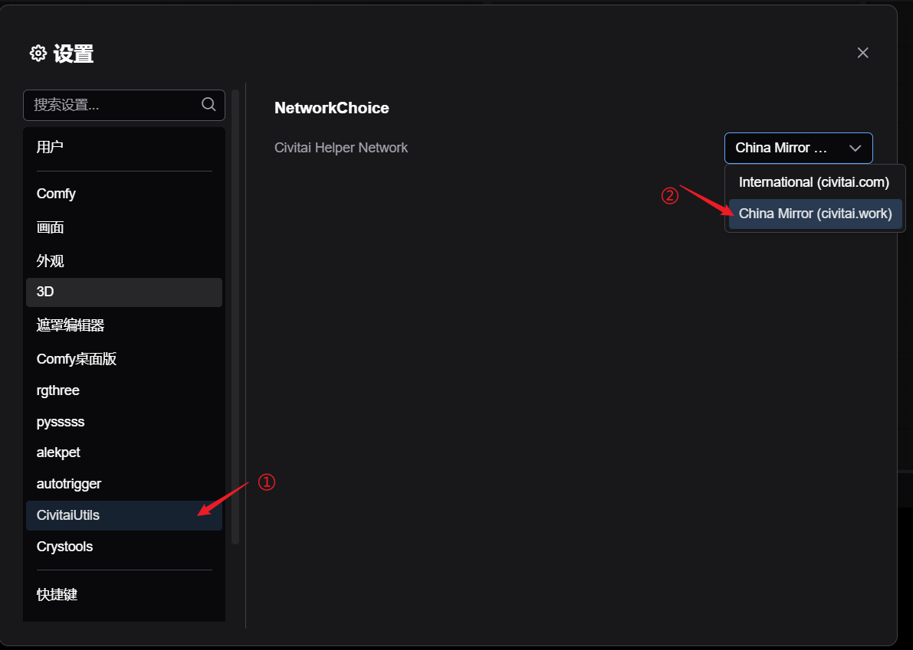

# Civitai Recipe Finder (Civitai 配方查找器)

## 功能说明

要创作出惊艳的 AI 艺术作品，关键在于找到完美的“**配方 (Recipe)**”——即模型、触发词、提示词和生成参数的理想组合。**Civitai Recipe Finder** 是一套为 ComfyUI 设计的强大节点工具集，旨在通过深度分析 Civitai 社区数据或为您本地模型提供即时视觉反馈，帮你揭示这些创作配方。

本节点套件提供多维度的方式来探索创作配方：

  * **可视化查找配方**: 选择一个本地模型，即时浏览其在社区的热门作品画廊。只需单击，即可应用完整配方——包括提示词、参数和 LoRA 组合，甚至支持一键加载工作流。
  * **即时查找触发词**: 快速获取任何 LoRA 模型的官方推荐触发词和元数据触发词。
  * **发现社区趋势**: 分析数百张社区图片，找到使用频率最高的正、负向提示词。
  * **揭示最佳参数**: 识别社区针对特定模型最常用的生成参数（采样器、CFG、步数等）。
  * **发掘“黄金组合”**: 发现哪些其他的 LoRA 模型最常与你选择的模型搭配使用。

整个套件基于模块化的设计哲学，让您既能进行快速的视觉查找，也能构建复杂深度的分析工作流，同时确保了最高效率。

## 节点套件说明

Recipe Finder 由三组独立的工具构成，以匹配您的不同需求。

### 1\. 可视化配方查找器 (Visual Recipe Finder)

#### `Civitai Recipe Gallery` (Civitai 配方画廊)

  - **用途**: 选择一个本地模型，可视化浏览社区的热门范例，并快速复现完整配方。
  - **【新增功能】**:
      - **【一键加载工作流】**: 节点上的 “🚀 Load Workflow” 按钮可以即时、安全地加载图片的原始工作流。它足够智能，如果检测到您安装了ComfyUI-Manager，会自动**在新的工作流标签页中加载**，保护您当前的工作。
      - **【保存源文件】**: 节点上的 “💾 Save Original” 按钮，可以将**包含完整工作流元数据**的、未经修改的原始图片，下载到您的ComfyUI `output` 文件夹中，方便归档。
  - **输入**: `model_name`, `sort`, `nsfw_level`, `image_limit`
  - **输出**:

| 输出端口 | 类型 | 说明 |
| :--- | :--- | :--- |
| `image` | `IMAGE` | 所选的范例图片，用于在当前工作流中预览或进行再处理。 |
| `info_md` | `STRING` | **唯一的、统一的报告**。用于理解配方的所有参数以及您本地LoRA的持有状态。请连接到`MarkdownPresenter`节点查看。 |
| `recipe_params`| `RECIPE_PARAMS`| 一个**数据管道**，包含所有核心参数，用于高级的自动化工作流。请连接到`Recipe Params Parser`节点解包。|

> [\!NOTE]  
> ⚠️ **首次运行耗时说明**
>
> * 初次运行会计算所有本地模型的 **hash**，耗时可能较长，请耐心等待。
> * 结果保存在 **`Civitai_Recipe_Finder/data`** 目录下。
> * 后续仅会计算缺失的模型。





#### `Recipe Params Parser` (配方参数解析器)

-   **用途**：`GalleryNode` 的必要配套节点。它能“解包”`recipe_params`数据管道，将其还原为多个独立的、可直接使用的参数输出，所有输出类型都经过修正，可直接与`KSampler`等下游节点兼容。
-   **输入**: `recipe_params`
-   **输出**: `positive_prompt`, `negative_prompt`, `seed`, `steps`, `cfg`, `sampler_name`, `scheduler`, `ckpt_name`, `width`, `height`, `denoise`。


### 2\. 轻量级工具 (Lightweight Tool)

这个独立节点专为高频、日常使用场景设计。

#### `Lora Trigger Words` (Lora 触发词)

  - **用途**: 无需任何重度处理，即时获取一个 LoRA 模型的两组核心触发词。
  - **输入**: `lora_name`, `force_refresh`
  - **输出**:

| 输出端口 | 类型 | 说明 |
| :--- | :--- | :--- |
| `metadata_triggers` | `STRING` | 从本地文件元数据提取的纯文本触发词。 |
| `civitai_triggers` | `STRING` | 从 Civitai API 获取的官方纯文本触发词。 |
| **`triggers_md`** | `STRING`|一份精美的Markdown表格报告，对比上述两种来源的触发词。请连接到`MarkdownPresenter`。|




### 3\. 分析器流水线 (Analyzer Pipeline)

这是一套为深度模型统计分析设计的强大、模块化的流水线。

#### `Civitai Data Fetcher (CKPT / LORA)` (数据获取器)

  * **用途**: 流水线的引擎。它为指定的模型获取所有社区图片元数据，并将其打包成一个数据包输出。**这是流水线中唯一进行重度网络请求的节点。**
  * **输入**: `model_name`, `max_pages`, `sort`, `retries`, `timeout`, `force_refresh`
  * **输出**: `civitai_data` (数据包), `fetch_summary` (STRING)。

#### `Prompt Analyzer` (提示词分析器), `Parameter Analyzer` (参数分析器), `Resource Analyzer` (关联资源分析器)

  - **用途**: 这些节点连接到获取器的`civitai_data`输出进行专项分析。**【它们的核心功能是生成清晰易读的分析报告。】**
  - **输出**:
      - 所有三个分析器现在都有一个**单一的、主要的Markdown报告输出** (`..._report_md`)。请将此端口连接到 `Markdown Presenter` 节点来查看分析结果。
      - 为方便起见, `ParameterAnalyzer` 额外输出了一小组最核心的参数（如 `sampler`, `steps`, `cfg`），可用于直接的流程自动化。




## 安装

1.  将项目文件夹放入 ComfyUI 的 `custom_nodes` 目录，例如：
    ```
    ComfyUI/custom_nodes/CivitaiProject/
    ```
2.  **安装所有必需的依赖项**。请在您的ComfyUI环境的终端中，运行以下命令：
    ```bash
    pip install -r requirements.txt
    ```
3.  重启 ComfyUI。你将在 `Civitai` 菜单及其子菜单中找到所有新节点。

> [\!TIP]  
> Markdown Presenter节点可在'Display'菜单找到，或双击搜索框中输入'Markdown Presenter'。

## 工作流示例

为方便使用，提供了一组工作流示例，存放于仓库目录 `./workflow_examples`，即 [ComfyUI-Civitai-Recipe/workflow\_examples](./workflow_examples)。


## 对于国内用户的支持

为保障国内互联网环境下的用户也能正常使用该自定义节点，在设置中加入了 **`Civitai Helper Network`**，用于选择访问 Civitai 时所使用的网络环境。

  * 对于中国用户，可选择 **`China Mirror`**（国内官方镜像）以更快、更稳定地访问 Civitai。
  * 默认选项为 **`International`**，适用于国际互联网环境用户。
  * 路径：`Settings` → `CivitaiUtils` → `Civitai Helper Network`。



## 鸣谢

本项目在开发过程中参考并借鉴了以下优秀开源项目：

* 获取触发词的逻辑，灵感与部分代码实现来源于 [Extraltodeus/LoadLoraWithTags](https://github.com/Extraltodeus/LoadLoraWithTags) 与 [idrirap/ComfyUI-Lora-Auto-Trigger-Words](https://github.com/idrirap/ComfyUI-Lora-Auto-Trigger-Words)。
* 画廊节点的设计思路参考了 [Firetheft/ComfyUI\_Civitai\_Gallery](https://github.com/Firetheft/ComfyUI_Civitai_Gallery)。

在此向以上项目及其作者们致以诚挚的感谢！

---